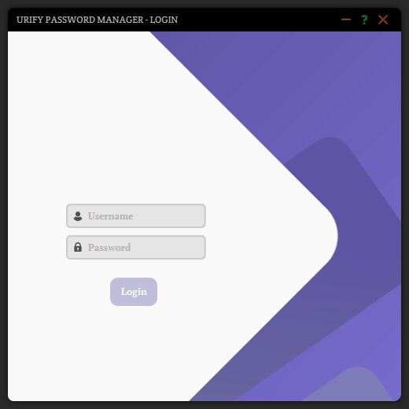
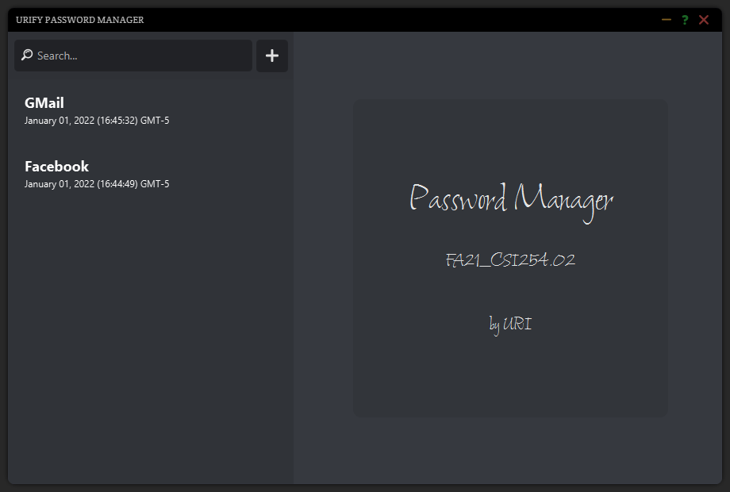
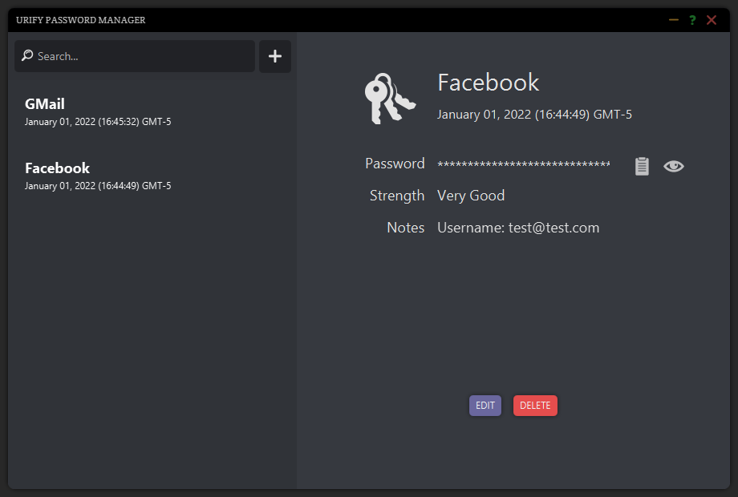
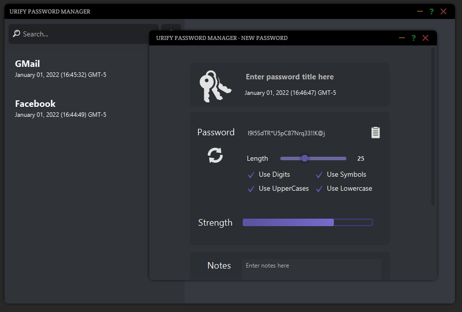
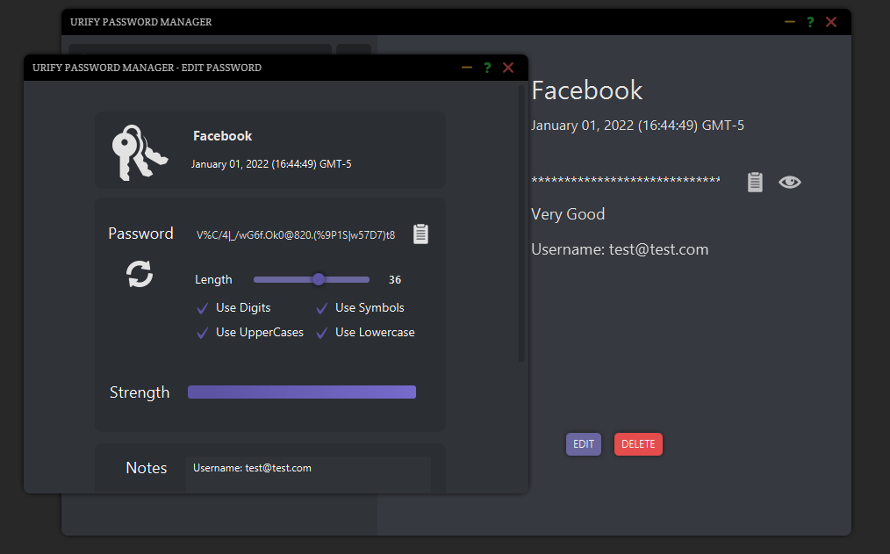

# PasswordManagerApp

 
A password manager GUI app written in Java with JavaFX. This app attempts to follow the three-tier design pattern (model, view, and controller), as well as the CRUD (create, read, update, delete) functionality. The idea of building a password manager app was random. However, the implementation of such subject focuses on a theoretical basis of storing a "secure" encoded generated passwords by salt hashing + base64, and decoding what is stored to display the once generated password to the user. While attempts were made to pursue such an ambitious goal in a short timeframe, keep in mind that the main priority of this project is to showcase one's ability to create a simple GUI app. The decision to use CSS, and JavaFX in itself (as supposed to using Swing as instructed), the use of JSON dependency for storing data, and many others were unnecessary. They were used regardless for aesthetic and personal familiarity.

**(NOTE: to run this app, JavaFX 17 is needed prior. Intellij was also used to create this app. If errors occured when running, make sure to follow [JavaFx's documentation](https://openjfx.io/openjfx-docs/).)**

## Disclaimer

This app was made as a final project for Java Programming course. Posting the enterity of the project as a repository is now for academic/collection/testing purposes. **Use at your own discretion.** (Copy-pasting is a violation to academic integrity.)